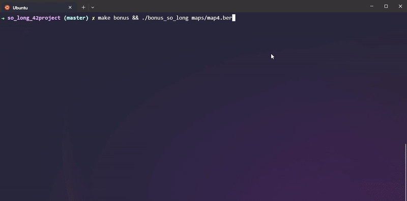

<div align="center">



---
Coded with 💗 by: [mflores-](https://github.com/mariav7)

</div>

## Project

[**Subject PDF**](misc/en.subject.pdf)

The purpose of so_long is to create our own 2D game using the [miniLibX library](https://github.com/42Paris/minilibx-linux).

The player’s goal is to collect all collectibles present on the map then be able to escape.

## Supported feautures

The project's requirements:
* Keys to move the main character:
  * `W` to go up or `⬆️`in bonus mode
  * `A` to go left or `⬅️` in bonus mode
  * `S` to go down or `⬇️` in bonus mode
  * `D` to go right or `➡️` in bonus mode
* To exit game:
  * press the `ESC` button
  * click the `X` on the window
* Map files must be (`.ber`) type
* Valid maps must be composed of the following characters:
  * `0` for an empty space
  * `1` for walls
  * `P` for the player's starting position
  * `C` for collectible items
  * `E` for an exit
* Maps must be closed/surrounded by walls
* The player must collect all the collectible items in order to escape
* Display of the current number of movements

---

## Installation

**Clone repo and compile project:**
```bash
git clone git@github.com:mariav7/so_long_42project.git
cd so_long_42project
```

**Compile and run the project in BONUS mode:**
```bash
make bonus && ./bonus_so_long maps/map1.ber
```

OR

**Compile and run the project in NORMAL mode:**
```bash
make && ./so_long maps/map1.ber
```

**To run script testing the different errors of invalid maps:**
```bash
./map_testing.sh
```
---
